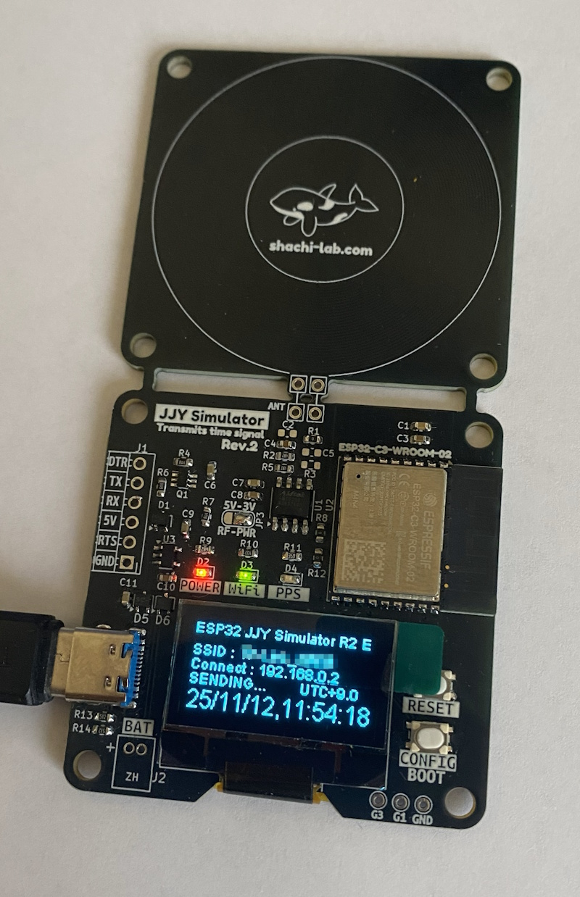

# JJY-SIM (JJY Time Signal Simulator for ESP32-C3 Rev.2)

[🇯🇵 日本語版はこちら](README_ja.md)

**JJY-SIM** is a compact time signal simulator that emulates Japan's JJY standard radio time code (40 kHz / 60 kHz) using an ESP32-C3 and the Arduino framework.  
It fetches accurate NTP time and generates a modulated JJY signal via PWM. 
**Rev.2** introduces an H-bridge RF output for higher transmission power and improved stability.

<a href="./images/jjy_sim_rev2_board_w800.jpg">
</a><br/>

---

## 🛠 Features

- Compact design based on **ESP32-C3 + Arduino**
- Easy Wi-Fi setup with one-button AP configuration
- OLED display showing the current time
- PWM output pins: **A = GPIO10**, **B = GPIO4**
- Selectable JJY frequency: **40 kHz (East Japan)** / **60 kHz (West Japan)**
- Built-in small antenna emits real RF signal
- H-bridge configuration for high output power (⚠ use responsibly)

---

## ⚙️ How to Build

1. **Set up ESP32 boards in Arduino IDE**
   - Boards Manager URL:  
     `https://dl.espressif.com/dl/package_esp32_index.json`
   - Target board: **ESP32-C3 Dev Module**

2. **Install required libraries**
   - [WiFiManager](https://github.com/tzapu/WiFiManager) (v2.0.17 recommended)
   - [ESP8266 and ESP32 OLED driver for SSD1306 displays](https://github.com/ThingPulse/esp8266-oled-ssd1306) (v4.6.0 recommended)

3. **Open the sketch**
   - File: `JJY_Sim_ESP32_C3_REV2.ino`
   - Edit frequency selection if needed:
     ```cpp
     #define JJY_TYPE 0   // 0: 40kHz, 1: 60kHz
     ```

4. **Compile and upload**
   - Select the correct board and COM port.
   - Click “Upload”.

> 💡 **Note:**  
> ESP32-C3 uses its built-in **native USB-UART** for flashing and serial communication.  
> On Windows, you may need the official **Espressif USB driver**:  
> [Download here](https://www.espressif.com/en/support/download/other-tools)

> ⚠ **First Boot:**  
> On first startup, the device creates a SPIFFS file system in internal flash.  
> It may appear frozen for 30 seconds.  
> Once finished, it will reboot automatically.

---

## 📶 Wi-Fi Setup

- After power-on or reset, press the **CONFIG** switch within 5 seconds.  
- An AP named `ESP32_XXXXXXXX` starts (password: `password`).  
- Connect from your phone or PC → set your Wi-Fi SSID and password via captive portal.

---

## 🕒 Operation

- If no button is pressed, the device connects to your Wi-Fi automatically.  
- Retrieves time from NTP server.  
- Displays current time on OLED.  
- Starts PWM JJY signal output synchronized to the next 0 second.  
- Place your radio-controlled clock near the antenna and press its “Receive” button.

---

## 🔌 Pin Assignments

| Function | GPIO | Description |
|-----------|------|-------------|
| JJY PWM Output | 10, 4 | Modulated signal (A/B for H-bridge) |
| CONFIG Switch | 9 | Wi-Fi setup (shared with BOOT) |
| ACT LED | 5 | Activity indicator |
| IND LED | 0 | Status indicator |
| OLED Reset | 2 | OLED hardware reset |
| OLED SDA | 7 | I²C data |
| OLED SCL | 6 | I²C clock |

---

## 🧾 File Structure

All Arduino source files are in the **`Source/`** folder:

```
JJY_Sim_ESP32_C3_REV2.ino   // Main sketch
wire_compat.h               // I²C compatibility header for ESP32-C3
shachi-lab_logo.h           // Logo bitmap
```

---

## 📚 Dependencies

- [WiFiManager](https://github.com/tzapu/WiFiManager)  
- [ESP8266 and ESP32 OLED driver for SSD1306 displays](https://github.com/ThingPulse/esp8266-oled-ssd1306)

---

## 🧰 Hardware Data

KiCad design files are included in the **`KiCad/`** folder.  
- Compatible with **KiCad v9** (older versions not supported)  
- **Gerber files** for fabrication are located in `KiCad/PLOT/`.

---

## ⚠ Legal Notice

This device emits real low-frequency RF signals.  
Please use it responsibly and ensure compliance with local radio regulations.

---

## 🔗 Related Links

- Blog article (Japanese, detailed build notes):  
  👉 https://blog.shachi-lab.com/047_jjy_sim_rev2/

